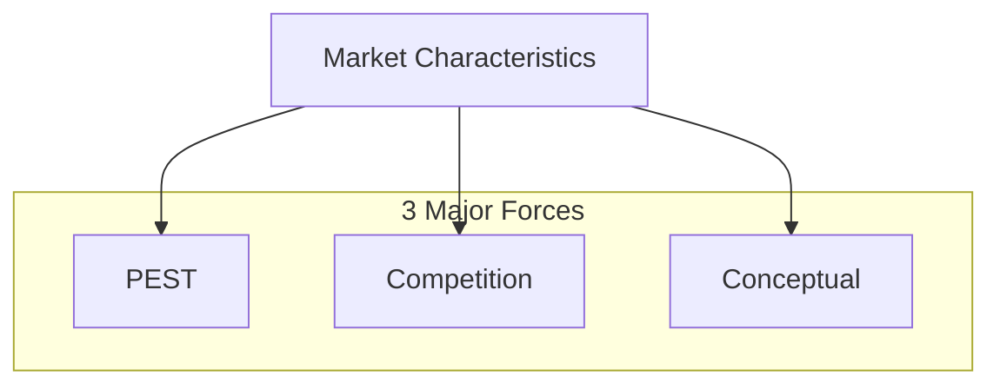
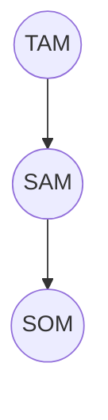
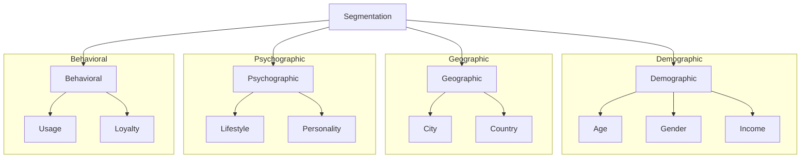
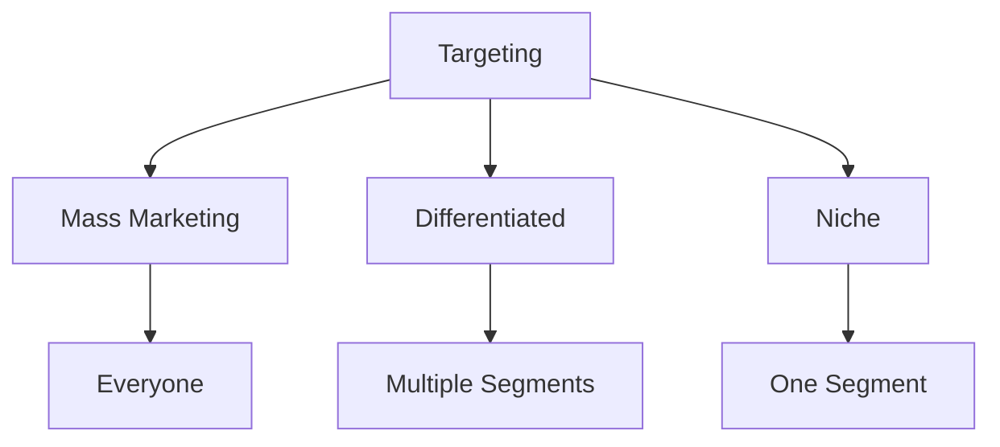

# MARKET ANALYSIS

Market
↓
is a place of potential customers
↓
it is not a place but a territory

Market Characteristics
↓

① [Size]
↓
market size tells you the total demand & sales
value of product / service in a market
↓
it can be measured in volume (units) & 
value (₹ cr, Rs. Bill)

Market size helps business know how big the 
opportunity is
larger size = more potential revenue

② [Growth rate]
↓
shows how fast the market is ↑ or ↓
Ex:- Swiggy, Zomato have been high-growth
due to inc. online usage
High growth means more opportunities
low or (-ve) growth — risky or saturated market

# 3 Penetration
Show how much the target market is already using the product.
$\downarrow$
means How many people who could use the product are actually using it.

**Ex:-**
*   Smartphones $\rightarrow$ $\uparrow$ penetration
*   EVs $\rightarrow$ still low penetration

*   **low penetration** $\rightarrow$ more scope for expansion
*   **high penetration** $\rightarrow$ market is saturated

# 4 Competition
$\downarrow$
refers to the No & strength of competitors in the market.

*   ($\uparrow$ control over) **low competition** — monopoly or few players
*   ($\downarrow$ price $\downarrow$) **High competition** — many firms fighting for customers

**Ex:-**
*   DRC skincare (mamaearth, Nykaa) $\rightarrow$ have high competition
*   Railway $\rightarrow$ low competition

# Product Life Cycle (PLC)
↓
Shows the stages a product goes through from launch to decline in the market

## 1. Introduction stage
* Product is newly launched
* Sales are low
* Profits are negative

* Marketing increases

* Customers are not aware
**Company focus on** awareness, promotion, distribution.

## 2. Growth
* Sales increase rapidly
* Profits rise
* More customers

* New competitors enter the market

**Company focus on:**
* Expanding market share
* Improving product quality

## 3. Maturity/Turbulence
* Sales reach peak (stable)
* Market becomes saturated
* Intense competition
* Price wars begin
**Company focus on:**
* Differentiation
* Cost control
* Brand loyalty
* Mergers and acquisitions happen.

## 4. Decline

* Sales decrease

* Product becomes outdated or replaced

* Profit falls

**Company focus on:**
* Reducing cost
* Exiting the market
* Innovating

Example: Petrol scooters decline due to electric vehicles. When penetration increases, the curve becomes flat.

focal point of market is consumers.

PLC Curve diagram

PLC Curve.

**Ex:-** Reel Camera & Digital Camera
market declines for reel camera but due to
substitute/ innovate it grows for digital camera.

Marketing Management

↓

all that a Co. does to
Create Customers

- identifying needs (what) & Solving them

- developing product (what)

- pricing (How much)

- promotion (How to)

- distribution (Where to sell)

**Need:-** Needs differ from person to person.

Any requirement that you can afford to fulfill

**Want:-** Something we choose among many options

Solution we choose to fulfill need is a want

**Ex:-** oral hygiene — a need

toothpaste — solution. (want)

# Determinants of market

Market characteristics are influenced by:
* penetration, size, growth, competition
* 3 major forces

## (1) PEST (Political, Economic, Social, Technological)

* **Political**: - Government policy, tax, regulations.
* **Economic**: - Income level, inflation
* **Social**: - Lifestyle, preference
* **Technological**: - Innovation.

## (2) Competition

* Number of players and their strength
* Influence price, quality, and innovation.

## (3) Conceptual

* Customer perception, brand positioning, and value proposition

# Marketing loop
Shows how Co. continuously improves decision.

## 3 loops
(Represented as a flow from Insights loop to Value Creation to Delivery)

### 1. Insights loop
*   **Understanding customer needs, market analysis**
    *   Their problem, behavior & collecting knowledge.
*   **Collect customer data**
    *   Identify pain points
    *   Track changing preferences
    *   Understand why customers buy & don't buy.

### 2. Value Creation
(Market analysis, segmentation & targeting)

### 3. Delivery

---

### Tools & methods
*   Survey & feedback forms
*   App
*   Social media
*   Reviews & ratings

**Ex:-**
*   **Zomato** tracks peak hour time
*   **Skincare** uses Instagram comments to understand demand

# 2 Value Creation

Designing products that solve customer problems and creating value

**Decides — what to offer**

* Product features
* Set pricing strategy
* Build brand positioning
* Identify target segment

**Tools:**

* STP (Segmentation, Targeting, and Positioning)
* Product design and innovation
* Pricing strategy
* Branding

Ex: EV — long battery duration
Food delivery — fast delivery + discounts

# 3 Delivery

Delivering the created value to customers effectively

* Product launch
* Distribution (online/offline)
* Marketing campaigns
* Customer experience management
* After-sales service

Understand customer → design solution → deliver.

# Branding (creating identity)
↓

Process of creating a unique identity or image for a product/company in the minds of customers.

Includes
- logo
- name
- design
- value
- customer experience

**Purpose:**
- Build trust
- Create recognition
- Differentiate from competitors

Ex: Tata Motors — trust

# Positioning (done before STP)
↓

## Brand Positioning (premium brand)
↓

Periodical change we bring in our product
↓

How a brand is perceived in the mind of a customer compared to competitors.

Handwritten notes on focus and Zepto example

**Focus:** long-term perception

Ex: We hear Zepto, quickly reminds us of fast delivery.

Handwritten notes on product positioning and Mamaearth example

(Affordable product)
## Product Positioning
↓

How a specific product is designed and presented
↓

Based on features, price, and benefits.

It answers: Why should I buy this product?

Ex: Why we buy Mamaearth, because it is natural, safe, and chemical-free.

- Service is something that you experience
- Product is something that you carry physically.
# BCG Matrix (Boston Consulting Group)
↓
a strategic tool
used by companies to analyze their
product based on
- Market Growth
- Market Share
It helps to decide where to <u>invest</u>,
<u>develop</u> or <u>withdraw</u>
<table>
    <tr>
        <th>Market share</th>
        <th>High</th>
        <th>Low</th>
    </tr>
    <tr>
        <td>**High**</td>
        <td>
invest &amp; grow 
**Stars** 
★ 
(future leaders)</td>
        <td>
invest / exit 
**Question mark (Risky)** ?</td>
    </tr>
    <tr>
        <td>**Low**</td>
        <td>
maintain 
**Cash cows** 
(money makers)</td>
        <td>
discontinue 
**Dogs**</td>
    </tr>
    <tr>
        <td></td>
        <td></td>
        <td>
market growth 
High</td>
    </tr>
</table>
① **Star** :- ↑ growth ↑ share
leading Brand in emerging market
- fast growing market
- strong position
- Require heavy <u>investment</u>
- future Cash Cow

# 2. Cash Cows ($\uparrow$ share $\downarrow$ growth)

Leading brand in a saturated market

- Stable market
- Strong position
- Need low investment

# 3. Question Mark ($\downarrow$ share $\uparrow$ growth)

- Growing market
- Weak positioning
- Need high investment
- Risky (can become a star or dog)

# 4. Dogs ($\downarrow$ share $\downarrow$ growth)

- Weak position
- Slow market
- Often discontinued

## 3 Types of Customer

### First Time Customers

New customers

- No experience with product
- Drives initial growth of the market

### Replacement

Already used the product before
- Replace old product with new one
- Maintain continuous demand

### Expansion

Who buy more of the same product
- Increase sales

# Brand
↓

a trust that you have built on some name.

## Brand Equity
↓

* **extra value a product gets**
* **the value or power a brand has because of**
    - Customer perception, trust & loyalty
    - Brand awareness
    - Brand loyalty

**Example:** local shoe - 1000
Nike - 5,000
why people pay more?
because of the name, value, trust.

## Competition Analysis
↓

products that are competing with you are not only the brands
↓

Price increase in one market
opens opportunity as a substitute in another market.

# Product mix
↓
total range of products a company sells.

## 3 dimensions

### Width (Breadth)
↓
Categories of product
Exs: LCD, LED etc.
Ex: HUL have
- personal care
- home care

### Length
↓
total items the company sells.
Ex: 12 soaps, 5 shampoos
total: 17 products.

### Depth
↓
No. of variants within each product
- Size
- Color
- flavor
Ex: Coca cola
- diet coke
- zero coke

# Concepts used to estimate market opportunity for a product / business

## TAM
### (Total Addressable Market)
Total demand for a product or service.
Ex: If every person in India ordered food, the total revenue generated would be TAM.

## SAM
### (Serviceable Addressable Market)
A portion of TAM that your business can actually target based on product and location.
Target market you can serve.
Ex: Food delivered only in <u>metro cities</u>, then only those customers form its SAM.

## SOM
### (Serviceable Obtainable Market)
A share of SAM that your company can capture.
Ex: Among all food delivery users, Zomato captures 25% of customers in metro cities, that is SOM.

*   **TAM** $\rightarrow$ all vehicle users in India
*   **SAM** $\rightarrow$ people interested in EV
*   **SOM** $\rightarrow$ customers buying EV

## Importance
- Helps in business planning
- Attract investors

# STP
(Segmentation, Targeting, Positioning)

↓
used to identify the right customers and position a product effectively.

## Segmentation
↓

dividing a large market into smaller groups based on similar features.

### Demographic
↓
*   Age
*   Gender
*   Income

### Geographic
↓
*   City
*   Country

### Psychographic
↓
*   Lifestyle
*   Personality

### Behavioral
↓
*   Usage
*   Loyalty

## Targeting
↓

selecting the most profitable and suitable segment to focus on.

### Mass Marketing
↓
Everyone.

### Differentiated
↓
multiple segments.

### Niche
↓
one segment.

# Positioning

Creating a unique image of the product in the Customer's mind

Ways of positioning

- Price
- Quality
- Lifestyle
- Features

Ex: Students, office worker, family (segment)
 
Focus on Students (target)

Fast delivery (positioning)

Importance

- Help identify right customers
- Improves marketing efficiency

# Porters' 5 forces
↓
helps you understand how competitive & attractive an industry is

## ① Competitive Rivalry
High Rivalry — low profit
Ex: Swiggy & Zomato

## ② Threat of New Entrants
low barrier → high threat

## ③ Bargaining power of Buyers
to demand at ↓ price or better quality.
Ex: food delivery users can switch b/w many apps.

## ④ Bargaining power of Suppliers
Ex: Battery suppliers influence EV Co's

## ⑤ Threat of Substitutes
availability of alternative products
Ex: Home Cooked food & Zomato.
Petrol vehicles & EV's

# SWOT
(Strength, weakness, Opportunity, Threat)
to analyze Co's internal & external environment

### ① Strength
in what things Co. does well
Ex: Apple - strong brand & innovation
Zomato - strong brand

### ② Weakness
Areas where Co lacks
Ex: high price limit Apple's customer base
Ex: Zomato - high delivery cost

### ③ Opportunities
favourable external conditions
Ex: growing EV demand
Zomato - growing online food market

### ④ Threat
External risks
Ex: high competition from brands like Samsung
Zomato - competition from Swiggy

Why SWOT
- Understanding competitive position
- Market entry decisions
- Risk identification

# PEST Analysis
$\longrightarrow$ EV Vehicles
* **Political** $\longrightarrow$ Govt policies, Subsidy, Import duty on battery & trade laws
* **Social** $\longrightarrow$ Environmental awareness, lifestyle changes, urbanization
* **Economical** $\longrightarrow$ Inflation, fuel price, Income level, int rates
* **Technological** $\longrightarrow$ Battery technology, R&D, charging infrastructure
EV $\longrightarrow$ size $\longrightarrow$ growing
- Growth Rate $\longrightarrow$ High
- Penetration $\longrightarrow$ low
- PLC $\longrightarrow$ Growth
- Segments $\longrightarrow$ 2 wheeler, 4 wheeler
Impact on demand
- cost impact — $\uparrow$ (raw material, battery)

$\rightarrow$ Online food delivery

$\downarrow$
grew rapidly after COVID

Size — large & expanding

Growth rate — High

Penetration — moderate

PLC — Growth

Segments — Urban users, Cloud Kitchens, Quick Commerce

Political $\rightarrow$ FDI rules, labor law (gig worker), food safety regulations

Economical $\rightarrow$ Income, inflation, fuel cost

Social $\rightarrow$ Lifestyle, convenience, urban working population

Technological $\rightarrow$ App technology, AI recommendations, delivery logistics

War impact — medium (fuel cost)

# Skincare Industry (D2C)

↓
Sell directly via online platforms

Popular among GenZ

**Size** : Growing

**Growth** : Very high

**Penetration** : Moderate

**PLC** : Growth

**Segments** : Organic, natural, premium, men's grooming

**Political** : Cosmetic regulations, import/export laws, ingredient approvals

**Economical** : Income, inflation, consumer spending

**Social** : Beauty awareness, social media influencers, lifestyle

**Technological** : E-commerce, AI skin analysis, product innovation

War impact → Low-Medium (ingredients)

# Market Analysis

$\rightarrow$ Electric Vehicles (EV) Industry
$\downarrow$

Includes electric car, bike, bus. 
In India, the EV market is growing due to 

Rising fuel prices, government schemes,

- Reduces dependence on oil imports
- Supports sustainability
- Creates new jobs in the battery and tech sector

① **Technological :-**
* Battery technology (cost, speed, lifespan)
* Charging infrastructure (fast, home charging, and battery swapping)

(More charging stations)

* Software and connectivity (EVs use apps, GPS tracking, improve user experience)

* Supply chain (reduce import dependence)

② **Social factors :-**

* Environmental awareness (pollution $\uparrow$ , EV $\uparrow$ )

* Rising fuel prices

* Urbanization and lifestyle

* Social media influence (faster awareness and adoption)

Impact of war: Battery price increase.

Impact on market characteristics:
Demand $\uparrow$ in urban areas

Growth $\uparrow$

Customer expectations.
Competition.

# Online food delivery industry
- part of digital economy
- creates gig jobs
- supports restaurants

## Technological factors:
* Mobile app (easy order, track, pay)
* AI & data analytics (suggest food based on preference)
  - it increases order frequency.
* Cloud Kitchens (No dine in so low cost)
* Logistics technology (GPS, track)

## Cost impact:
* Fuel price ↑
* Delivery charge ↑
* Profit margin ↓
* Food inflation ↑

## Social factors:
* Busy lifestyle (↑ demand)
* Changing food preferences
* Post-pandemic behavior
* Youth population (↑ app usage)

## Market Characteristics:
* **Demand** — ↑ in urban areas
* **Customer expectations** — fast delivery & discounts
* **Competition** — intense price wars
* **Growth Potential** — still growing but low profit

# → D2C personal care (skincare)

Ex:- Nykaa.

- eliminates middlemen

## Technological factors:-
* E-Commerce platforms
↑ profit margin.
* Social media marketing
* product innovation

## Clear impact:-
↑ cost inflation ↑ spending ↓

## Social factors:-
* Beauty awareness
* Influencer culture
* Health consciousness
* Gender neutral trends

Demand — rapid ↑
Customer expectations — safe, effective, natural product
Competition — very ↑
Growth — strong

# Competitor Analysis
$\rightarrow$ Electric vehicles
$\downarrow$
about the industry & war impact (fuel, raw material, supply chain)

① **Direct Competitors** (same product + same need)
- Ola electric
- Ather Energy

② **Indirect Competitors** (Alternative Solutions)
- Petrol vehicles
- Public transport
- CNG vehicles

## Competitor profiling
**Ola Electric** $\rightarrow$
- **Strategy** - D2C
- **Pricing** - penetration
- **USP** - tech + affordability
- **Strength** - scale prodn.
- **Weakness** - service gap, Customer Complaint

**Ather Energy** $\rightarrow$
- **Market position** - premium
- **Strategy** - quality
- **USP** - software updates
- **Strength** - Strong R&D
- **Weakness** - High price

**Competitive Strategy** -
- Cost Cut (direct to customer)
- Differentiation
- Ecosystem.